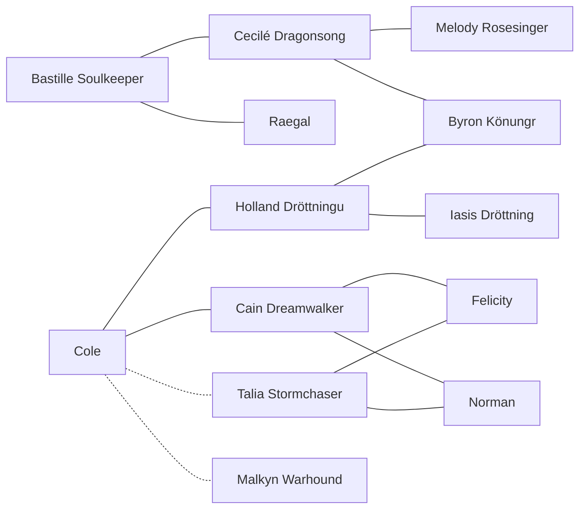

---
{"dg-publish":true,"permalink":"/bastille-soulkeeper/","dgHomeLink":false,"dgPassFrontmatter":false}
---

- [[SKYFALL|Back to Home]]
- [[Timeline|To Timeline]]

# Bastille Soulkeeper
>Favored of the dragons

Bastille is a 20 year old [[Human|human]] [[Dragon Rider|Rider]], bonded with [[Octavia|Octavia]]. He has [[Elves|elven]] blood from his mother, [[Cecilé Dragonsong|Cecilé Dragonsong]], and therefore looks as if he has been a [[Dragon Rider|Rider]] for longer than he actually has been (on account of the [[Dragon Rider|Riders]] typically undergoing a gradual change in their appearance after bonding). 

**Recorded Names**
- Raegalsson, given by [[Human|humans]], for his heritage
- Soulkeeper, given by [[Dragon Rider|Riders]], for the number of [[Eldunarí|Eldunarí]] that have been gifted to him by the wild dragons
- Mindbreaker, given by [[Elves|elves]], for his talent for silent and mental magic
- Darkling, given by [[Urgals|urgals]], for his black hair and black dragon
- Stealthwalker, given by [[Urgals|urgals]], seemingly inheritted from [[Echo|Echo]]
- Friend of the Werecats, typical of those with [[Werecat|Werecat]] companions
- Shur'tugal ("Dragon Rider"), typical of all [[Dragon Rider|Riders]] ([[Ancient Language|Ancient Language]])
- Argetlam ("Silverhand"), typical of all [[Dragon Rider|Riders]] ([[Ancient Language|Ancient Language]])
- Hilmir, very rarely, for his relation to [[Byron Könungr|Byron Könungr]]

**Family & Relations**
- Parentage: [[Cecilé Dragonsong|Cecilé Dragonsong]] and [[Raegal|Raegal]]
- Siblings: [[Versailles Silverblade|Versailles Silverblade]]
- Extended Family: [[Holland Dröttningu|Holland Dröttningu]], [[Cain Dreamwalker|Cain Dreamwalker]], [[Talia Stormchaser|Talia Stormchaser]], [[Malkyn Warhound|Malkyn Warhound]], [[Cole|Cole]]
- Significant Other: [[Hazel Goldenblood|Hazel Goldenblood]]

## Aiedail
Bastille carries the blade [[Aiedail|Aiedail]] ("morning-star"). 

## Family Tree View
